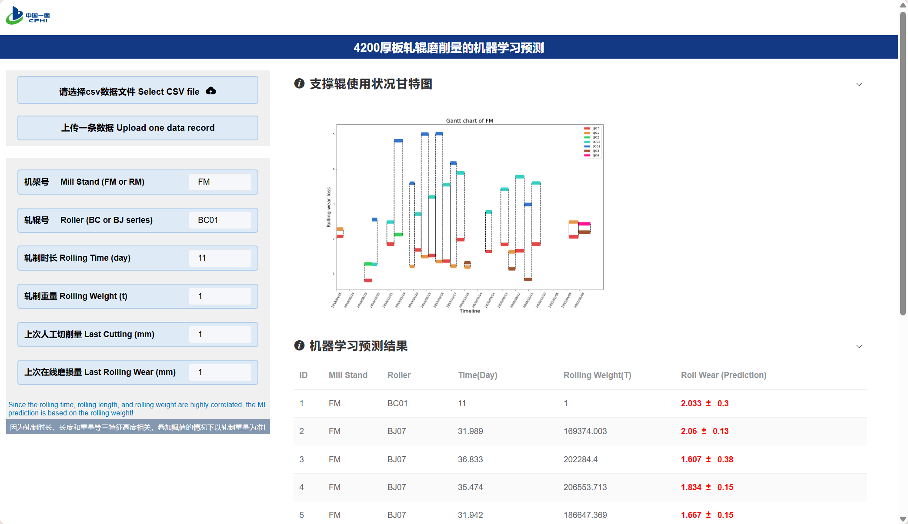

# The Backend of 4DD project
## Main purposes
<h3> 1. use machine learning methods to predict rolling wear </h3>
   
* SVR, GPR, RFR, GBR

<h3> 2. use matplotlib to visualize the rolling situation </h3>

## Tech: Flask, Vue2, Sklearn

## Frontend Available <a herf="http://114.55.87.45:2423">Here</a>
## Online Website <a herf="https://github.com/Better-Ding/4DD_Project_front">Here</a>

